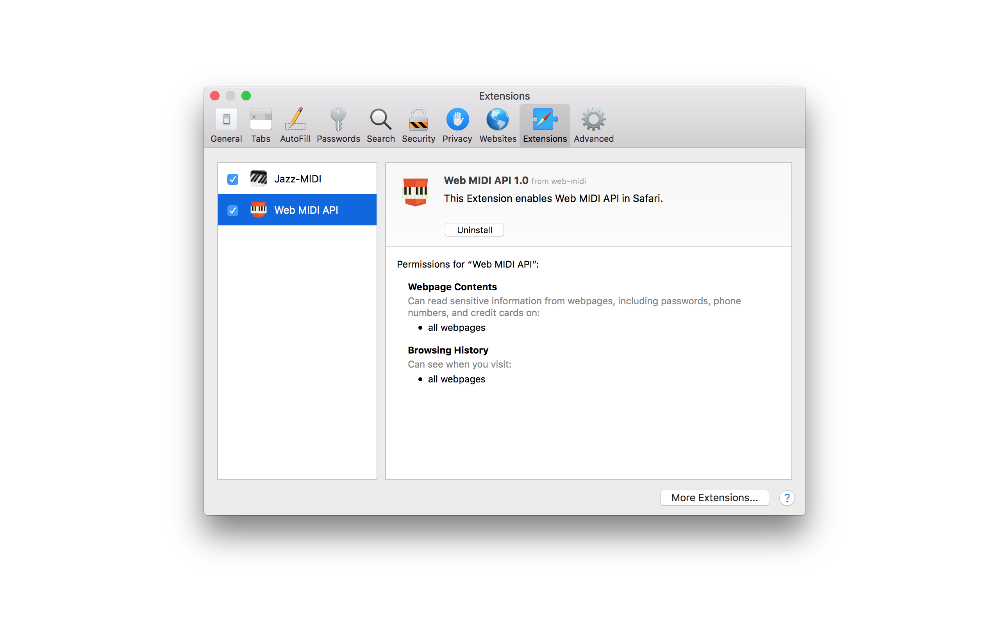

# web-midi media resources

## Help needed!

We would really appreciate your help with localizing the extension for *your native language*.

To add a new language, for example, **zz (Klingon)**:

- clone this repository
- copy `firefox/web-midi/_locales/en/messages.json` to `firefox/web-midi/_locales/zz/messages.json`
- translate the `extensionDescription.message` string in the new `messages.json` file
- copy `media/en.md` to `media/zz.md`
- translate the relevant text (except the headers) in the new `zz.md` file
- commit the new files and open the pull request

**NO GOOGLE TRANSLATE PLEASE!**

We also need your help to ensure that the existing translations are in sync with the English version,
free from typos and don't sound awkward.

### Currently available:

[**en (English)**](en.md)  
[**es (Spanish)**](es.md)  
[**ru (Russian)**](ru.md)  

[Privacy Policy](PRIVACY.md)  

## Images

#### icon128.png

#### 16.png

#### 32.png

#### 64.png

#### 128.png

#### 256.png

#### 512.png

#### 1024.png

#### safari-install-2560-1600.png

